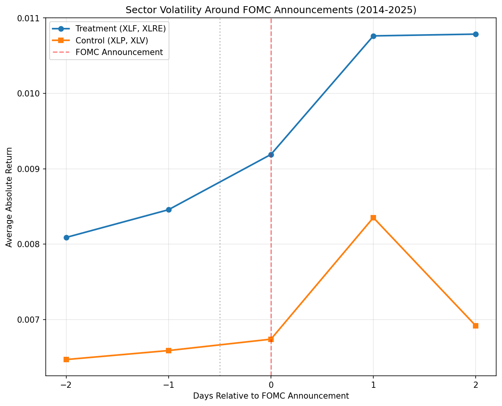
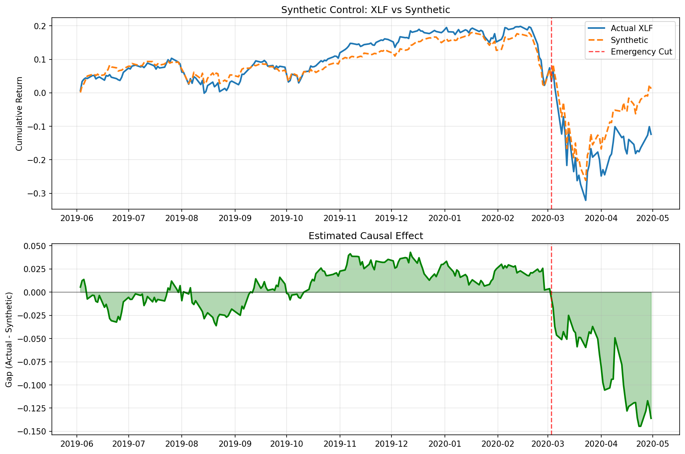
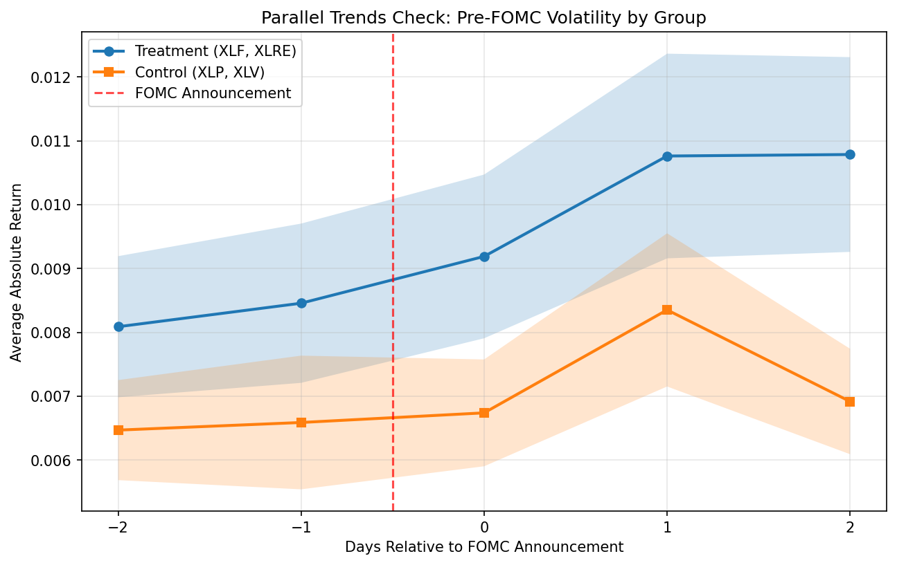

# Fed Volatility Causal Inference

Causal inference analysis of Federal Reserve announcements on sector volatility using difference-in-differences and synthetic control methods.

## Key Findings

- **DiD Result:** FOMC announcements cause an additional **0.12% (12 basis points)** volatility in rate-sensitive sectors (financials, real estate) compared to defensive sectors (consumer staples, healthcare). Statistically significant at p=0.043.

- **Synthetic Control Result:** The March 2020 emergency rate cuts caused financials (XLF) to underperform by **-13.6%** compared to what a synthetic control predicts would have happened.

## Methods

### Difference-in-Differences
Compares volatility changes around FOMC announcements between:
- **Treatment:** XLF (Financials), XLRE (Real Estate) — directly affected by rate changes
- **Control:** XLP (Consumer Staples), XLV (Healthcare) — less rate-sensitive

Uses clustered standard errors by event date to account for correlation within announcements.

### Synthetic Control
Constructs a weighted combination of donor sectors to estimate what financials would have done absent the March 2020 emergency cuts. Weights are optimized to match pre-event behavior.

## Project Structure
```
fed-volatility-causal-inference/
├── data/
│   ├── raw/                  # FOMC dates, sector prices
│   └── processed/            # Event panel
├── src/
│   ├── data/                 # Data collection and processing
│   │   ├── get_prices.py
│   │   └── build_panel.py
│   └── analysis/             # Statistical analysis
│       ├── event_study.py
│       ├── did_estimator.py
│       ├── synthetic_control.py
│       └── parallel_trends.py
└── outputs/                  # Figures and results
```

## Results

### Event Study


### Synthetic Control


### Parallel Trends


## Data Sources

- **Sector ETF Prices:** Yahoo Finance (2014-2025)
- **FOMC Meeting Dates:** Federal Reserve (federalreserve.gov/monetarypolicy/fomccalendars.htm)

## Requirements
```
yfinance>=0.2.36
pandas>=2.0.0
numpy>=1.24.0
matplotlib>=3.7.0
statsmodels>=0.14.0
scipy>=1.10.0
```

## Usage
```bash
# Get price data
python src/data/get_prices.py

# Build event panel
python src/data/build_panel.py

# Run analyses
python src/analysis/event_study.py
python src/analysis/did_estimator.py
python src/analysis/synthetic_control.py
python src/analysis/parallel_trends.py
```

## References

- Abadie, A., Diamond, A., & Hainmueller, J. (2010). Synthetic Control Methods for Comparative Case Studies. *Journal of the American Statistical Association*.
- MacKinlay, A. C. (1997). Event Studies in Economics and Finance. *Journal of Economic Literature*.
